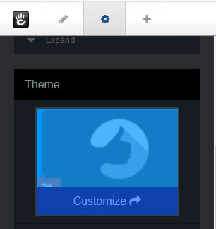
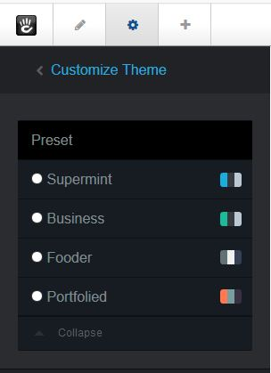

.. index:: Option; presets

#######
Presets
#######
 In the Dashboard under "Supermint options" there are three choices,

 * Theme options
 * Sliders
 * Fonts
 
 .. image:: ./figures/presets/dashboard-supermint-options.jpg
 
 each with its own options page that has a preset dropdown selector. All options
 are saved in the database, grouped into presets. Each preset therefore contains
 general options of the theme, the sliders and fonts. The other two choices
 
 * Site settings
 * Presets
 
 do not have a preset dropdown selector on the page.
 
 
.. index:: Option; presets-selector
 
Presets selector
****************

 The choice of presets available is displayed on the top left, in each page of
 options. When you save a page of options, they will **only** be saved in the
 preset THAT is displayed on the top left.

 .. image:: ./figures/presets/dashboard-supermint-options-preset-selector.jpg

.. index:: Option; presets-manage
.. index:: Option; presets-add
.. index:: Option; presets-import
.. index:: Option; presets-export

Manage Presets
**************

 On the Theme presets page, you can set as default, add, delete, rename, export,
 and import presets.

 .. image:: ./figures/presets/dashboard-supermint-options-manage-presets.jpg
 .. image:: ./figures/presets/dashboard-supermint-options-manage-presets-add.jpg
 .. image:: ./figures/presets/dashboard-supermint-options-manage-presets-export-import.jpg

.. index:: Option; presets-apply-to-whole-site

Apply presets to whole site
***************************
  To set a preset for the **whole site**, go to the 
  Dashboard->Supermint Options->Presets page, then in the "Manage presets"
  section click on the button "Set as Default".

 .. image:: ./figures/presets/dashboard-supermint-options-manage-presets-default.jpg

.. index:: Option; presets-apply-to-a-page

Apply presets to pages
**********************

 Sometimes we need a site that has some pages with a different appearance. For
 this we can create different preset, set one for the whole site and apply 
 another to certain pages.

 **Overview**
 
  To apply a preset on a **page only**, go to the Customize theme page and set
  the attribute **Preset Option**.

 **Details**
 
  1. Exit edit mode (go back to site) by clicking on the pencil in the editing
     toolbar.
  2. Goto the page that needs editing.
  3. Click on the gear in the editing toolbar upper left.
  4. Follow concrete5 page edit drop down
     `documentation <https://documentation.concrete5.org/editors/in-page-editing/the-toolbar/page-edit-drop-down>`_.
     Click on the "Design" selection

-----

5. Under the Theme box, click on "Customize" in the theme icon.

-----

6. Pick one of the presets radio buttons.

-----

7. Click on the "Save" button
8. Click on the "This page" button

 .. image:: ./figures/presets/dashboard-supermint-options-manage-presets-single-page.jpg

-----

Original reference: web.archive.org
`page <https://web.archive.org/web/20180327084941/http://supermint3.myconcretelab.com:80/index.php/documentation/options-framework/options-preset>`_

