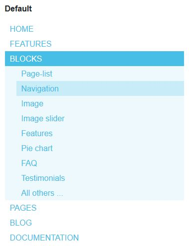
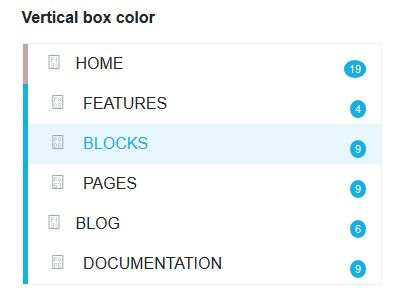
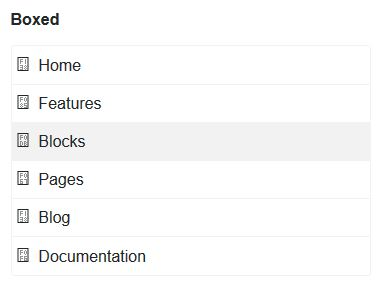
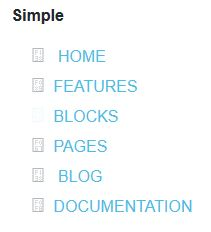
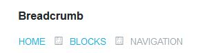

.. index:: Blocks; Navigation

#################
Blocks Navigation
#################
Different templates for the autonav block

Autonav block has a number of customized templates. 4 are used for navigation
and the header are automatically loaded by the theme. The others can be added
anywhere on a page. It's the ones that we will see it in detail.

.. Warning::
   **Supermint, Supermint Dropdown** are specialized for the top-nav. It can't
   be used in a page content

----

Examples:

.. index:: Blocks; navigation-default
.. index:: Blocks; navigation-vertical-box-color

-----

.. index:: Blocks; navigation-boxed
.. index:: Blocks; navigation-simple

-----

.. index:: Blocks; navigation-breadcrumb

