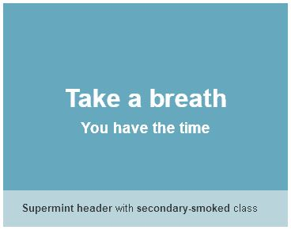
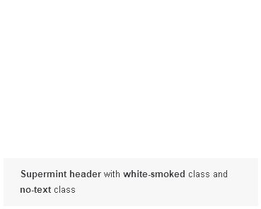
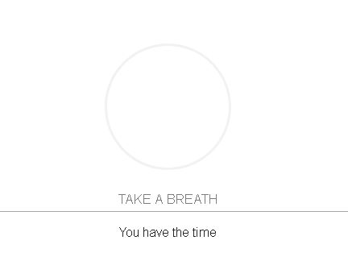
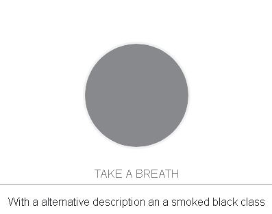

#############
Blocks, Image
#############
  All custom templates and classes for the built-in image block.

  Supermint use intensivly the built-in image block in different way. Discover
  how to play with custom templates and custom classes

**************
Custom Classes
**************

.. index:: Classes; Smoked

Smoked Classes
==============
 Add a subtle color overlay on image to fit exactly with your color scheme

       + black-smoked
       + primary-smoked
       + secondary-smoked
       + tertiary-smoked
       + quaternary-smoked
       + white-smoked

.. index:: Classes; No-text

No Text class
=============
     Disable the displaying of Heading in image

       + no-text

.. index:: Classes; Height

==============
Height Classes
==============
     Used in Supermint Header to set the height of the banner. The value is
     relative to a percent of the display (80 = 80% of the browser view area)

       + height-80
       + height-50
       + height-30

.. index:: Classes; Into-columns

Miscellaneous
=============
 **into-columns** is used when the Supermint Header template
 is placed in a area smaller than a full width container or if you want to
 see headline that take all the width of the image.

       + into-columns

****************
Custom templates
****************

.. index:: Templates; Header

Supermint Header
================
 Below is the **Supermint Header** custom template. This template supports
 multiple Custom classes as **smoked** or **height**. It also uses the file
 title and description (or from the block itself if filled) to display
 Headlines. This headline functionality can be disabled by adding **no-text**
 custom class.

 <example missing>

 **Supermint Header** doesn't need to be placed in a full width area. It can
 also display image where you want in the page. The only thing is that th
 e height is set relative to the screen **and** the image is cropped to fit the
 dimension and that you must set the class **into-columns** to set reset the
 width of the headline container.

-----

Below we have added a content block under the image block with the custom class
**image-caption-inside**.

.. image:: ./figures/blocks_image/supermint-header-with-black-smoked-class.jpg

.. index:: Templates; Columns

Supermint 2 columns
===================
Here the text is come from the "Alt.text" field in the image block. This
template also support smoked class.

< example missing >

.. index:: Templates; Hover

Supermint Hover
===============
In the live demonstration the images bounce when hovered with the cursor.

* This template follow the design line as Feature block.

* This template supports Custom class **smoked**.

.. index:: Templates; Caption

Supermint caption
=================

 This custom work exactly as the default template for the image block but with
 a caption.

 Set it outside

.. image:: ./figures/blocks_image/supermint-caption-set-outside.jpg

or inside the image, set the color (primary,..)

.. image:: ./figures/blocks_image/supermint-caption-set-inside.jpg

and for inside, set if it will show only when over.

.. image:: ./figures/blocks_image/supermint-caption-set-inside-on-hover.jpg

All these settings can be set by `Custom classes <./05-block-area-layout-classes.html>`_
on the block.

-----

Original reference: web.archive.org
`page <https://web.archive.org/web/20180112075033/http://supermint3.myconcretelab.com:80/index.php/blocks/image>`_
