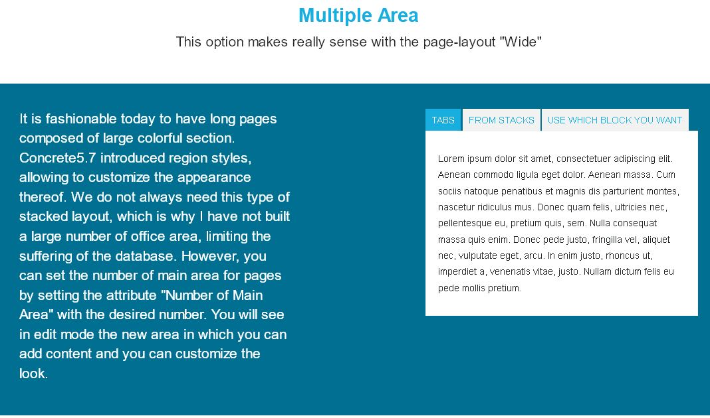
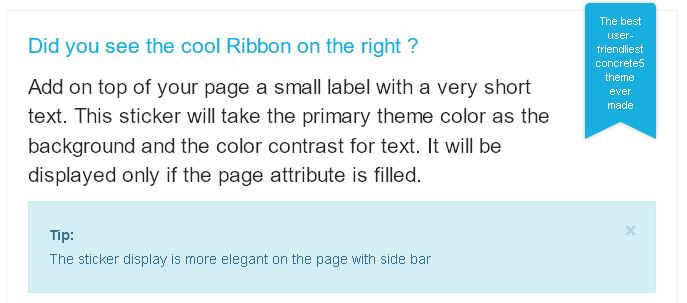
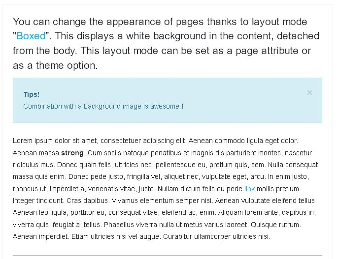

##################
Page customization
##################
Customize pages in many ways.

**********************************
Discover how to personalize a page
**********************************

.. index:: Customize Page; color

Page Color
==========

  See in the top menu, and in `some template navigation <https://web.archive.org/web/20180111065348/http://supermint3.myconcretelab.com:80/index.php/blocks/navigation>`_
  , a color that is assigned to pages. By default, the selected color is the
  **primary** theme color. Assign colors individually for each page by changing
  the attribute **Main Page Color**.

  [Sc: The attribute main_page_color]

.. index:: Customize Page; icon

Page Icon
=========

  Change the default icon for **all pages** or for each page
  **separately**.

  - **To change the default icon applied to all pages**

    Reference the theme options page *Slide Navigation* section to change
    the `related option <./03a-theme-options.html#default-nav-block-icon>`_ .

  - **To change the icon of the pages separately**

    Edit the attribute of the page in question and choose an icon with the
    attribute Icon From FontAwesome.

.. index:: Customize Page; miniature

Miniature
=========

  The miniature pages are used in Supermint in ``page-list``. This file
  dimension are adapted as required, so no need to resize the image, the theme
  will do it. To assign an image to a page, fill the **Thumbnail**
  attribute of this page with a valid image.

* **Background image of a page**

  With Supermint, it is possible to add a background image to a page. In order
  to have a background image, simply fill in the attribute "background page" in
  property page.

.. Note::
   If the page is not in "Boxed" do not hesitate to use 
   `area classes <./06-area-classes.html#area-classes>`_
   that will give a pleasing background color.

.. index:: Customize Page; background image slideshow

Background image slideshow
==========================

  It is also possible to add multiple background images on a page. For this
  create a
  `file sets <https://documentation.concrete5.org/editors/dashboard/files/sets>`_ 
  that will contain all the desired images and choose the file group with the
  page attribute **background slider** in properties of page. It might be 
  possible to set a default file for all pages.
  
  <background image slider example missing>

.. index:: Customize Page; preset option

Apply a preset option
=====================

  If different options settings are needed for all pages, or for a particular
  page, simply create a page preset and apply through the attribute 
  **Supermint theme Option Preset**.

.. index:: Customize Page; multiple main area

Multiple Main Area
==================

  It is fashionable today to have long pages composed of large colorful section.
  Concrete5 introduced Area styles, allowing to customize the appearance thereof.
  We do not always need this type of stacked layout, which is why I have not
  built a large number of office area, limiting the suffering of the database.
  Set the number of main area for data pages by setting the attribute
  **Number of Main Area** with the desired number. In edit mode see the new
  area where content can be added and customized.

.. index:: Customize Page; colorful sticker

Colorful Sticker
================

  Add on top of the page a small label with a very short text. This sticker
  will take the primary theme color as the background and the color contrast for
  text. It will be displayed only if the page attribute is filled. To display
  the sticker, fill the attribute **Text for the Ribbon** with a
  short sentence::

.. Note::
   The **sticker** display is more elegant on the full page or side
   bar page template.

.. index:: Customize Page; boxed

Display Mode "Boxed"
====================

  Change the appearance of pages mode to "Boxed". This displays a
  white background in the content, detached from the bottom of the page body.
  For this Boxed Set the mode in theme options in the "Layout".

-----

Original reference: web.archive.org `page <https://web.archive.org/web/20180111062951/http://supermint3.myconcretelab.com:80/index.php/documentation/page-customization>`_
